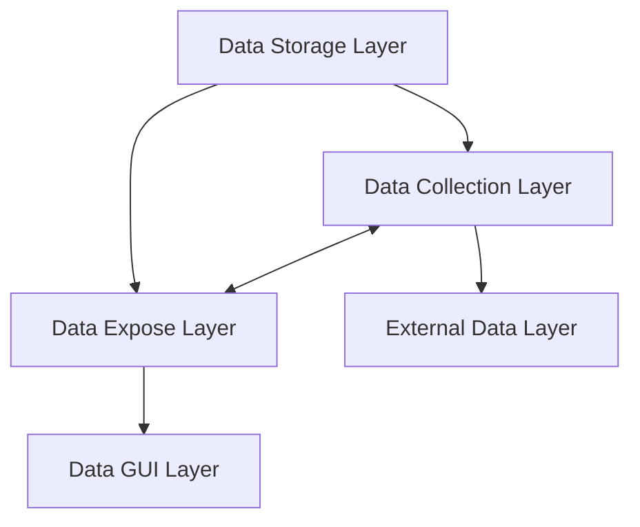
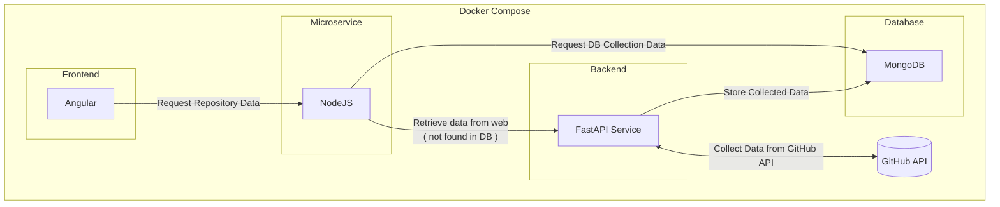

# Architecture

## Layers of the Architecture

The architecture of the project is divided into several layers, each responsible for a specific aspect of the application.

### Description of Layers

- **Data Storage Layer (MongoDB)**: Central storage for repository data, ensuring efficient data management and retrieval.
- **Data Expose Layer (Node.js Microservice)**: Fetches repository data from MongoDB for the frontend.
- **Data Collection Layer (FastAPI)**: Collects repository data from the external source (GitHub API) and stores it in storage layer (MongoDB) upon request from the data expose layer.
- **External Data Layer (GitHub API)**: External source of repository data, accessed by the data collection layer to gather repository information.
- **Data GUI Layer (Frontend - Angular)**: Displays repository data in an interactive and responsive user interface.

### Data Flow

In summary, the Backend (FastAPI) collects data from GitHub and stores it in MongoDB. The Node.js microservice retrieves the data from MongoDB and sends it to the frontend. If the data is not found in MongoDB, the microservice requests it from the FastAPI. The frontend is responsible for displaying the data.

## Description:

- **Frontend**: The Angular application is responsible for providing a user-friendly interface to display the repository data. It communicates with the Node.js microservice to fetch the data.

- **Microservice**: The Node.js microservice retrieves the repository data from MongoDB and sends it to the frontend. If the data is not available in the database, it requests it from the FastAPI service.

- **Backend**: The FastAPI service collects the repository data from the GitHub API and stores it in MongoDB. It acts as the intermediary between the frontend and the database.

- **Database**: MongoDB serves as the central storage for repository data. It ensures efficient management and retrieval of the data.

## Communication between Layers

The communication between the layers is achieved through RESTful APIs. The FastAPI service exposes endpoints to collect data from the GitHub API and store it in MongoDB. The Node.js microservice fetches the data from MongoDB and sends it to the frontend. The frontend interacts with the microservice to display the repository data.

## API Endpoints

The **Backend FastAPI** service exposes the following endpoints:
- `/repo/{repo_id}`: Retrieves the details of a specific repository from the GitHub API and stores it in MongoDB.

The **Node.js microservice** exposes the following endpoints:

- `/repos`: Retrieves the list of repositories from the database.
- `/repo/{repo_id}`: Retrieves the details of a specific repository from the database. If the data is not found, it requests it from the backend service.

## User Interaction

App shows a search bar to search for repositories and display the list of repositories.

List repositories are fetched directly from the databse and details are fetched from the backend service.

Clicking on a repository will send a request the details from the Database via Node microservice 

search function - search for repository details via microservice :

Activated on click the repo name from the list or from the seraach bar button click. 