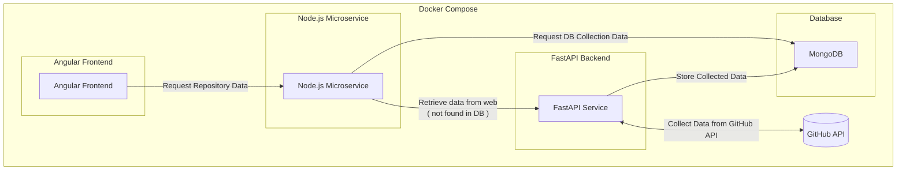

# Architecture

## Overview

Graph of the architecture of the project.

In short, the FastAPI is simply to get the data from Github and store it in MongoDB. 
The Node.js microservice is to get the data from MongoDB and send it to the frontend. 
If Node.js does not find the data in MongoDB, it will request the data from FastAPI.
The frontend is to display the data.

## Description

### Node.js Microservice:

Interacts with MongoDB to fetch repository data.
If the data is not found in MongoDB, it requests data collection from the FastAPI service.

### FastAPI Backend:

Collects data from the GitHub API.
Stores the collected data in MongoDB.
Provides the collected data to the Node.js microservice if requested.

### Database (MongoDB):

Stores the repository data collected by the FastAPI service.
Provides stored data to the Node.js microservice when requested.

### GitHub API:

Source of the repository data that the FastAPI service collects.
This diagram outlines the flow of data and the interaction between the Node.js microservice, FastAPI backend, MongoDB, and the GitHub API.

